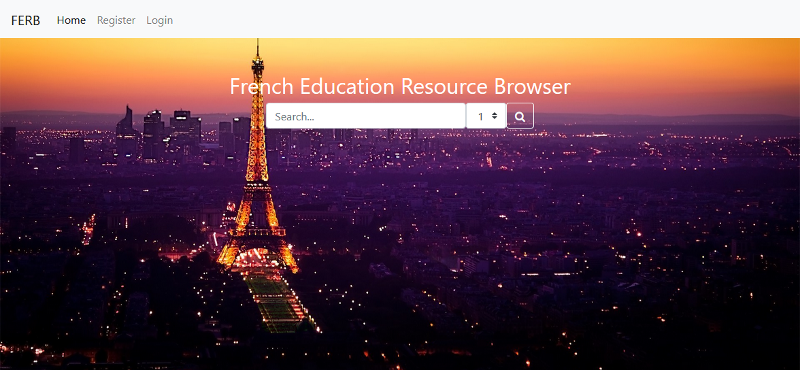

# FERB - French Education Resource Browser
Search Engine for French articles/websites/blogs etc.




## Set UP
Set up for windows machines

```
$ python -m venv venv
$ venv\Scripts\activate.bat
(venv) $ pip install -r requirements.text
(venv) $ set FLASK_APP=run.py
(venv) $ cd searchengine
(venv) $ flask run

```
